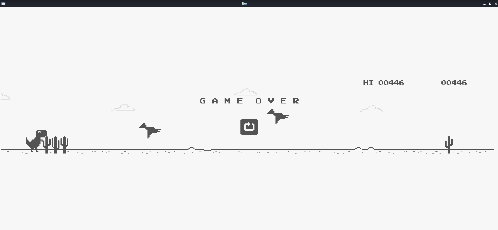

# Rex

Chrome Game Trex dino demo implemented in pure C using [Nuklear](https://github.com/Immediate-Mode-UI/Nuklear) with OpenGL graphic engine as backend



## Usage

In linux:
```zsh
# in Rex project directory
$ make
```
executable file will be generated in 'bin' directory.

## TODO

1. Night mode
2. Cross-platform support
3. More intelligent objects generating strategy

## Attention

This game relies on OpenGL engine in linux. So it only passed tests in linux.   
You'd better build this project in linux rather than Windows or mac os.
